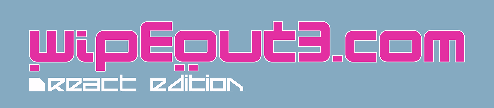

# wipeout3.com — React Edition



The 1999 _Wipeout 3_ [Flash](https://en.wikipedia.org/wiki/Adobe_Flash) website, designed by [The Designers Republic](http://www.thedesignersrepublic.com/), developed by [Kleber](http://kleber.net), published by [Psygnosis](http://www.psygnosis.co.uk) — rebuilt in [React](https://reactjs.org/).

**Live Site:** [wipeout3.app](https://wipeout3.app)

Original Flash Website: wipeout3.com | kleber.net/wipeout3 _(no longer active)_.

> **Community Project** — This is an unofficial recreation. Wipeout 3 is © Sony Interactive Entertainment / Psygnosis. Not affiliated with Sony, Psygnosis, Kleber, or The Designers Republic.

## Tech Stack

- [React](https://reactjs.org/)
- [TypeScript](https://www.typescriptlang.org/)
- [Tailwind CSS](https://tailwindcss.com/)
- [Vite](https://vitejs.dev/)
- [React Router](https://reactrouter.com/)
- [Howler.js](https://howlerjs.com/)
- [ESLint](https://eslint.org/)

## Getting Started

1. Clone the repository

```bash
git clone https://github.com/devhowyalike/wipeout3-react.git
```

2. Install dependencies

```bash
cd wipeout3-website
pnpm install
```

> **Prerequisites:** This project uses [pnpm](https://pnpm.io). If you don't have it: `npm install -g pnpm`

3. Start the development server

```bash
pnpm dev
```

For full setup instructions — including environment variables and production builds — see [CONTRIBUTING.md](CONTRIBUTING.md).

<!-- ## About the Project

### Developer Statement

Lorem ipsum dolor sit amet, consectetur adipiscing elit, sed do eiusmod tempor incididunt ut labore et dolore magna aliqua. -->

## Quality of Life Improvements

**Wip3out R3act** (wipeout3.com: React Edition) includes a number of quality of life improvements over the original Flash website, covering mobile support, accessibility, modals, widescreen monitor enhancements, and page-specific enhancements.

For the full reference, see [Quality of Life improvements](docs/QualityOfLife.md).

## Options

The new Options menu provides user-configurable settings stored in the browser's `localStorage`, allowing the user to customize the experience to their preference. It is accessible via the settings icon in the UI.

Individual options can be toggled independently, or users can apply one of two presets:

- **Pure Mode** (restores the original 1999 Flash experience)
- **React Mode** (the default React Edition configuration).

For the full options reference, see [Options](docs/OPTIONS.md).

> **Note:** Sound effects are subject to browser autoplay policies and will not play until the user first interacts with the page. See [Sound & Autoplay](docs/OPTIONS.md#sound--autoplay) in the options reference.

## Technical Notes

For implementation details — including the critical CSS injection strategy, SVG-to-video conversion pipeline, and Flash animation approach — see [Technical Notes](docs/TechnicalNotes.md).

## Work in Progress

The following pages are incomplete due to the complexity of their animations, and are actively in progress:

- [ ] Complete the individual **Teams** pages _([GitHub Issue](https://github.com/devhowyalike/wipeout3-react/issues/2))_
- [ ] Complete the **Welcome** page _([GitHub Issue](https://github.com/devhowyalike/wipeout3-react/issues/3))_

## Special Thanks

Wip3out R3act was made possible thanks to the Flash archive documented by [supersocks](https://omamoka.com/wipeout3/). Special thanks to them for their efforts in preserving the original website. For more information about their work, see their post [here](https://www.wipeoutzone.com/forum/showthread.php?10638-Back-up-of-the-original-wipEout-3-website-materials).

Thank you to [NR74W](https://github.com/NR74W/WipEout-Fonts) for their Wipeout fonts repository.

Big shoutout to the [WipeoutZone forums](https://www.wipeoutzone.com) and [r/WipeOut](https://www.reddit.com/r/WipeOut/) for their support and feedback.

And thank you to [The Designers Republic](http://www.thedesignersrepublic.com/), [Kleber](http://kleber.net), [Psygnosis](http://www.psygnosis.co.uk), and Sony Interactive Entertainment for creating the original website and the world it came from.

## Additional Tools Used

- [JPEXS Free Flash Decompiler](https://github.com/jindrapetrik/jpexs-decompiler)
- [SVG to Video Script](scripts/svg-to-video/README.md) — converts SVG frame sequences into alpha-channel WebM/MOV videos

## Contributing

Contributions are welcome. Please read [CONTRIBUTING.md](CONTRIBUTING.md) before opening a pull request — it covers the dev setup, code style, branching conventions, and commit message format.

## License

This project is licensed under [CC BY-NC-SA 4.0](https://creativecommons.org/licenses/by-nc-sa/4.0/) — a digital preservation license. See [LICENSE](LICENSE.md) for details.

> Original site by Kleber & The Designers Republic. Wipeout 3 is © Sony Interactive Entertainment / Psygnosis. 2026 YAMEEN & THE W1P30UT.R3ACT PROJECT
